# Hsin-Chen Pai

CS undergrad on the **NCKU × Purdue dual-degree** programme, Class of 2027.
Co-founder and CTO of **TREKX** (travel tech) · research assistant on active cyber-defence at **NYCU**.

I build AI applications and full-stack systems — and ship them.

- 🔬 **Research** — referring multi-object tracking. [GMC-Link](https://github.com/Seanachan/GMC-Link) compensates for camera ego-motion in RMOT models: **+53.5% HOTA on Refer-KITTI** (14.08 → 21.62).
- 🛠 **Building** — small tools that solve a problem I actually hit, deployed the same week.
- 🌐 **Portfolio** — [seanachan.github.io](https://seanachan.github.io/) — bilingual 中/EN, résumé included.

**Stack:** Python · TypeScript · Java · C / PIC18F assembly · C# (Unity)

Open to 2027 new-grad SWE roles.

---

### Selected work

| Project | What it is |
|---|---|
| [GMC-Link](https://github.com/Seanachan/GMC-Link) | Plug-and-play module letting RMOT models compensate for camera ego-motion on motion-referring expressions. Python. |
| [seanachan.github.io](https://github.com/Seanachan/seanachan.github.io) | This portfolio — Astro, statically generated, fully bilingual 中/EN. |
| [trip-schedule](https://github.com/Seanachan/trip-schedule) · [live](https://seanachan.github.io/trip-schedule/) | Renders a travel itinerary straight from an Obsidian note. TypeScript. |
| [trip-debt-calculator](https://github.com/Seanachan/trip-debt-calculator) · [live](https://seanachan.github.io/trip-debt-calculator/) | Split trip expenses, settle up at the end. TypeScript. |
| [wenyan-compiler](https://github.com/Seanachan/wenyan-compiler) | Compiler for wenyan-lang, the classical-Chinese programming language. C. |
| [Welcome-on-board](https://github.com/Seanachan/Welcome-on-board) | Autonomous car on PIC18F4520 + XC8, with a paired voice-command Android app. Embedded C / assembly. |

---

