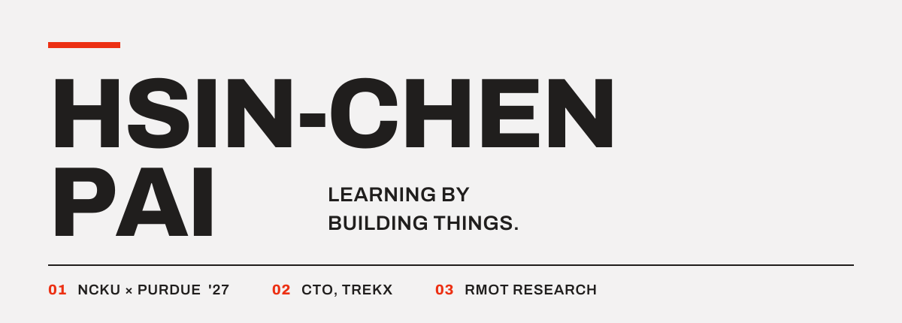

<picture>
  <source media="(prefers-color-scheme: dark)" srcset="./profile/header-dark.svg">
  
</picture>

## Now

CS on the NCKU × Purdue dual-degree programme, graduating 2027. Co-founder and CTO
of **TREKX**, a travel-tech startup. Research assistant on active cyber-defence at **NYCU**.

My research is referring multi-object tracking — getting a tracker to follow the objects
a sentence is actually talking about. My side work is small tools I needed on a trip and
shipped the same week. Both are below.

Open to 2027 new-grad SWE roles.

## Selected work

| | Project | |
|---|---|---|
| **01** | **[GMC-Link](https://github.com/Seanachan/GMC-Link)** — camera ego-motion compensation for RMOT models, as a drop-in module. | **+53.5% HOTA** on Refer-KITTI, 14.08 → 21.62 |
| **02** | **[FlexHook-CF](https://github.com/Seanachan/FlexHook-CF)** — counterfactual hard negatives for two-stage RMOT, extending FlexHook (CVPR'26). | Negatives built offline, so **zero inference cost** |
| **03** | **[case-smith](https://github.com/Seanachan/case-smith)** — regression tests for legacy VB.NET from a 7–8B local model. | Structure is deterministic code; the model only fills semantics |
| **04** | **[stock-pred](https://github.com/Seanachan/stock-pred)** — multi-stock PPO agent over 46 Taiwan large/mid caps. | Redeployed live every day at 11:00 by CI |
| **05** | **[seanachan.github.io](https://github.com/Seanachan/seanachan.github.io)** — this portfolio. Astro, static, no backend. | Complete 中/EN translation, not decoration |
| **06** | **[trip-schedule](https://github.com/Seanachan/trip-schedule)** · **[trip-debt-calculator](https://github.com/Seanachan/trip-debt-calculator)** — itinerary from an Obsidian note; split the bill after. | Both [live](https://seanachan.github.io/trip-schedule/) on Pages |
| **07** | **[Welcome-on-board](https://github.com/Seanachan/Welcome-on-board)** — autonomous car on PIC18F4520, paired with a voice-command Android app. | 90% zero-shot voice-command accuracy |

## Working in

`Python` · `TypeScript` · `Java` · `C` · `PIC18F assembly` · `C#`

## Elsewhere

**[Portfolio](https://seanachan.github.io/)** — bilingual, résumé included · **[LinkedIn](https://www.linkedin.com/in/hcpai)** · **[Email](mailto:hsinchen.pai1218@gmail.com)**
